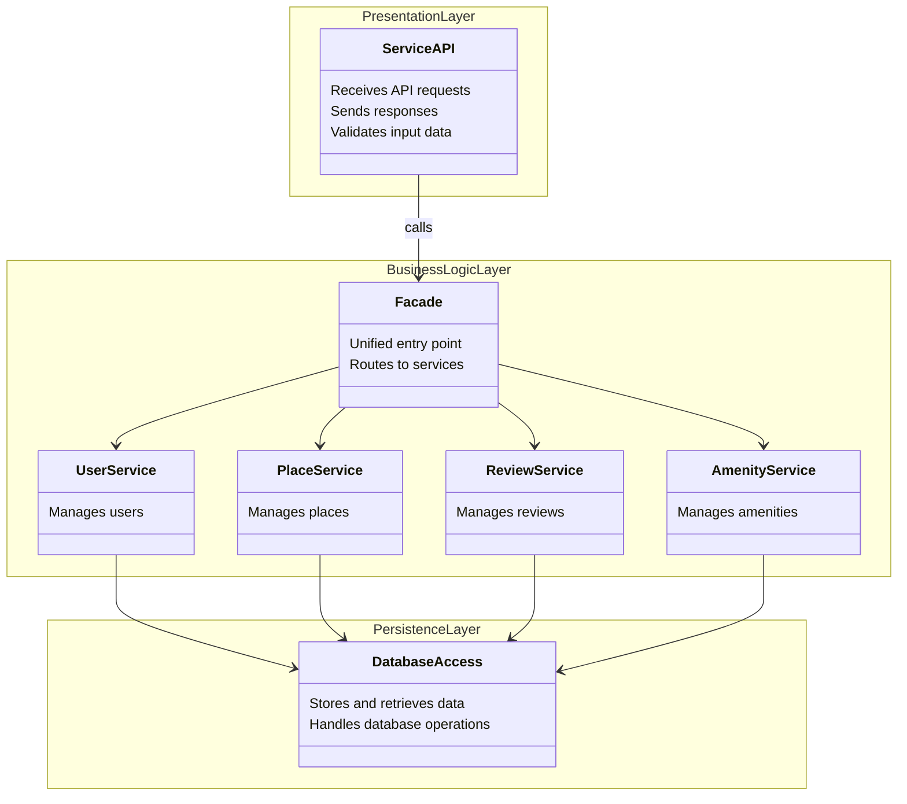
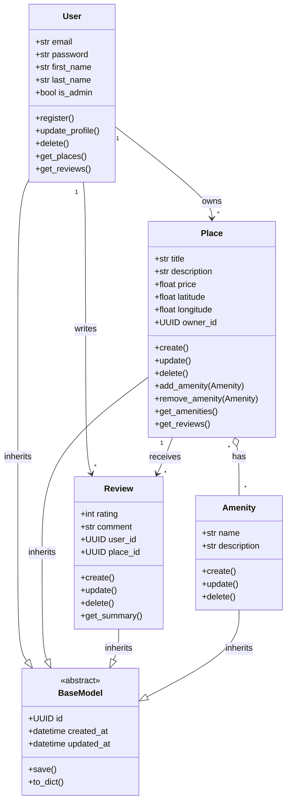
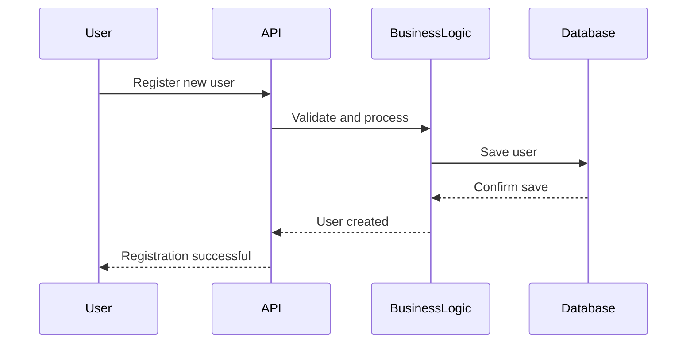
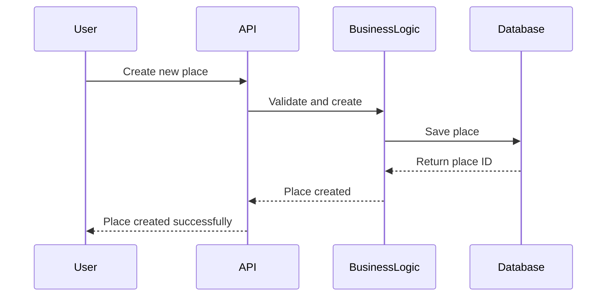
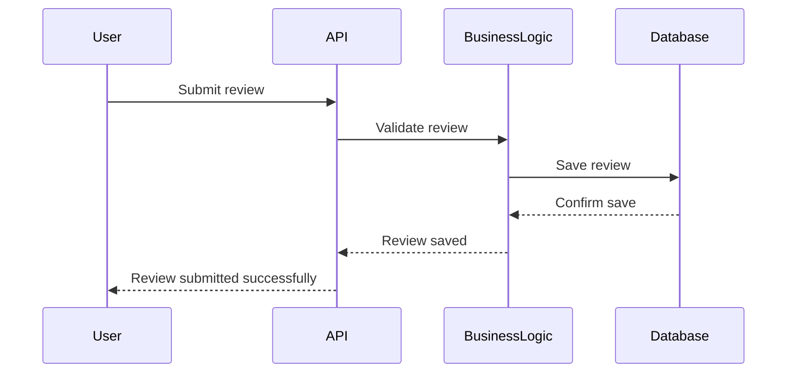
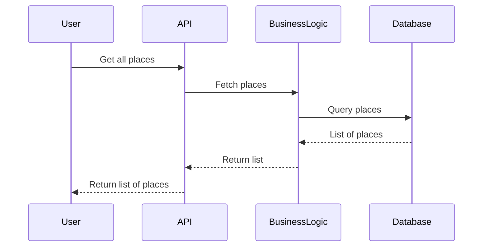

# Holberton School - HBnB

## 📌 Overview

This project is the first part of the **HBnB** (Holberton BnB) application, focused on designing the technical architecture through UML documentation. It covers the high-level package architecture with the Facade pattern, detailed class diagrams for the business logic layer, and sequence diagrams for the four main API operations (user registration, place creation, review submission, and fetching places).

---

##  Architecture Overview

### Layered Architecture

The application follows a **3-tier architecture** that ensures modularity, testability, and maintainability:



### Layer Descriptions

- **Presentation Layer (API)**: Handles HTTP requests and responses. It exposes REST API endpoints, validates input data format, and returns appropriate HTTP status codes. This layer does not contain any business logic.

- **Business Logic Layer**: Contains the core application logic and business rules. It processes data through service classes (UserService, PlaceService, ReviewService, AmenityService) unified behind a **Facade Pattern** that provides a single entry point for the Presentation Layer.

- **Persistence Layer**: Manages data storage and retrieval. It implements the Repository Pattern to abstract database operations, providing a clean interface for the Business Logic Layer through Data Access Objects (DAO).

### Communication Between Layers

The layers communicate through well-defined interfaces following a **top-down dependency flow**:

1. The **Presentation Layer** calls the **Facade** (in the Business Logic Layer) to process requests — it never accesses the Persistence Layer directly.
2. The **Facade** delegates to the appropriate service, which applies business rules and then calls the **Persistence Layer** through repository interfaces.
3. Responses flow back up through the same chain: Persistence → Business Logic → Presentation.

---

# Detailed Class Diagram - Business Logic Layer

## Overview

This diagram represents the core entities of the HBnB application: **User**, **Place**, **Review**, and **Amenity**. All entities inherit from a **BaseModel** class that provides common attributes and methods.

## Class Diagram




## Relationships

| Relationship | Type | Description |
|--------------|------|-------------|
| User → Place | One-to-Many | A user can own multiple places |
| User → Review | One-to-Many | A user can write multiple reviews |
| Place → Review | One-to-Many | A place can receive multiple reviews |
| Place ↔ Amenity | Many-to-Many | Places can have multiple amenities, amenities can belong to multiple places |

> **Multiplicity notation**: `1` = exactly one, `*` = zero or more (many).


## Entity Descriptions

### BaseModel (Abstract Class)
The base class for all entities, providing common functionality.

| Attribute | Type | Description |
|-----------|------|-------------|
| `id` | UUID | Unique identifier for each object |
| `created_at` | datetime | Timestamp of creation |
| `updated_at` | datetime | Timestamp of last update |

| Method | Description |
|--------|-------------|
| `save()` | Persists the object to the database, updates `updated_at` |
| `to_dict()` | Returns a dictionary representation |


### User
Represents a user of the application.

| Attribute | Type | Description |
|-----------|------|-------------|
| `email` | str | User's email (unique) |
| `password` | str | Hashed password |
| `first_name` | str | User's first name |
| `last_name` | str | User's last name |
| `is_admin` | bool | Admin privileges flag |

| Method | Description |
|--------|-------------|
| `register()` | Creates a new user account |
| `update_profile()` | Updates user information |
| `delete()` | Removes the user |
| `get_places()` | Returns all places owned by user |
| `get_reviews()` | Returns all reviews written by user |


### Place
Represents a property listing.

| Attribute | Type | Description |
|-----------|------|-------------|
| `title` | str | Place title |
| `description` | str | Place description |
| `price` | float | Price per night |
| `latitude` | float | GPS latitude |
| `longitude` | float | GPS longitude |
| `owner_id` | UUID | ID of the owner (User) |

| Method | Description |
|--------|-------------|
| `create()` | Creates a new place listing |
| `update()` | Updates place information |
| `delete()` | Removes the place |
| `add_amenity()` | Associates an amenity with the place |
| `remove_amenity()` | Removes an amenity association |
| `get_amenities()` | Returns all amenities of the place |
| `get_reviews()` | Returns all reviews for the place |


### Review
Represents a user review for a place.

| Attribute | Type | Description |
|-----------|------|-------------|
| `rating` | int | Rating (1-5) |
| `comment` | str | Review text |
| `user_id` | UUID | ID of the reviewer |
| `place_id` | UUID | ID of the reviewed place |

| Method | Description |
|--------|-------------|
| `create()` | Creates a new review |
| `update()` | Updates the review |
| `delete()` | Removes the review |
| `get_summary()` | Returns a brief summary |


### Amenity
Represents an amenity that can be associated with places.

| Attribute | Type | Description |
|-----------|------|-------------|
| `name` | str | Amenity name (e.g., "WiFi", "Pool") |
| `description` | str | Amenity description |

| Method | Description |
|--------|-------------|
| `create()` | Creates a new amenity |
| `update()` | Updates the amenity |
| `delete()` | Removes the amenity |


---

# Sequence Diagrams

## Overview

These diagrams illustrate the interaction flow between the different application layers for the main API operations. Each diagram is accompanied by the corresponding API specifications.


## 1. User Registration



### Flow Description

1. The user sends their registration information (email, password, first name, last name)
2. The API receives the request and forwards it to the business layer
3. The business logic validates the data (unique email, valid format, strong password)
4. If valid, the password is hashed and the user is saved to the database
5. The confirmation is sent back up to the client

### API Specifications

| Method | Endpoint | Description |
|--------|----------|-------------|
| `POST` | `/api/v1/users/` | Create a new user |

**Request Body (JSON)**:
```json
{
  "email": "user@example.com",
  "password": "securePassword123",
  "first_name": "John",
  "last_name": "Doe"
}
```

**Response Codes**:

| Code | Status | Description |
|------|--------|-------------|
| `201` | Created | User successfully created |
| `400` | Bad Request | Invalid data (malformed email, missing fields) |
| `409` | Conflict | Email already used by another account |


## 2. Place Creation



### Flow Description

1. The authenticated user sends the details of the place to create
2. The API verifies the JWT token and extracts the user ID
3. The business logic validates the data (positive price, valid coordinates)
4. The place is created with the user as the owner
5. The unique place ID is returned to the client

### API Specifications

| Method | Endpoint | Description |
|--------|----------|-------------|
| `POST` | `/api/v1/places/` | Create a new place |

**Required Headers**:
```
Authorization: Bearer <JWT_TOKEN>
```

**Request Body (JSON)**:
```json
{
  "title": "Downtown Paris Apartment",
  "description": "Beautiful bright apartment...",
  "price": 120.00,
  "latitude": 48.8566,
  "longitude": 2.3522,
  "amenities": ["wifi-uuid", "parking-uuid"]
}
```

**Response Codes**:

| Code | Status | Description |
|------|--------|-------------|
| `201` | Created | Place successfully created |
| `400` | Bad Request | Invalid data (negative price, out-of-range coordinates) |
| `401` | Unauthorized | Missing or invalid JWT token |


## 3. Review Submission



### Flow Description

1. The authenticated user submits a review for a place
2. The API verifies the authentication and forwards to the business layer
3. The business logic checks that:
   - The place exists
   - The user is NOT the owner of the place
   - The rating is between 1 and 5
4. The review is saved with the user_id and place_id references
5. Confirmation is sent to the client

### API Specifications

| Method | Endpoint | Description |
|--------|----------|-------------|
| `POST` | `/api/v1/places/{place_id}/reviews/` | Create a review for a place |

**Required Headers**:
```
Authorization: Bearer <JWT_TOKEN>
```

**Request Body (JSON)**:
```json
{
  "rating": 5,
  "comment": "Excellent stay, very clean and well-located apartment!"
}
```

**Response Codes**:

| Code | Status | Description |
|------|--------|-------------|
| `201` | Created | Review successfully created |
| `400` | Bad Request | Invalid rating (must be between 1 and 5) |
| `401` | Unauthorized | Missing or invalid JWT token |
| `403` | Forbidden | User cannot review their own place |
| `404` | Not Found | Place not found |


## 4. Fetching Places



### Flow Description

1. The user (authenticated or not) requests the list of places
2. The API forwards the request with any filters
3. The business logic builds the query with pagination
4. The database returns the results
5. The data is formatted (including amenities, owner) and sent back

### API Specifications

| Method | Endpoint | Description |
|--------|----------|-------------|
| `GET` | `/api/v1/places/` | Retrieve all places |
| `GET` | `/api/v1/places/{place_id}` | Retrieve a specific place |

**Optional Query Parameters**:

| Parameter | Type | Description |
|-----------|------|-------------|
| `page` | int | Page number (default: 1) |
| `per_page` | int | Results per page (default: 20, max: 100) |
| `price_min` | float | Minimum price per night |
| `price_max` | float | Maximum price per night |

**Response Codes**:

| Code | Status | Description |
|------|--------|-------------|
| `200` | OK | List of places returned successfully |
| `404` | Not Found | Place not found (for GET by ID) |

**Example Response**:
```json
{
  "places": [
    {
      "id": "uuid-place-1",
      "title": "Downtown Paris Apartment",
      "price": 120.00,
      "owner": {
        "id": "uuid-user-1",
        "first_name": "John"
      },
      "amenities": ["WiFi", "Parking"]
    }
  ],
  "total": 42,
  "page": 1,
  "per_page": 20
}
```

## HTTP Status Codes Summary

| Code | Name | Usage |
|------|------|-------|
| `200` | OK | Successful request (GET, PUT) |
| `201` | Created | Resource successfully created (POST) |
| `204` | No Content | Successful deletion (DELETE) |
| `400` | Bad Request | Invalid request data |
| `401` | Unauthorized | Authentication required or invalid token |
| `403` | Forbidden | Action not allowed for this user |
| `404` | Not Found | Resource not found |
| `409` | Conflict | Conflict (e.g., email already in use) |


---

## Technologies & Tools Used

- **Mermaid.js** - Diagrams
- **UML Standards** - sequence diagram

---

## Authors

| Name | GitHub |
|------|--------|
| Victor | [GitHub](https://github.com/victormonnot) |
| Virginie | [GitHub](https://github.com/v-lmb) |

---
